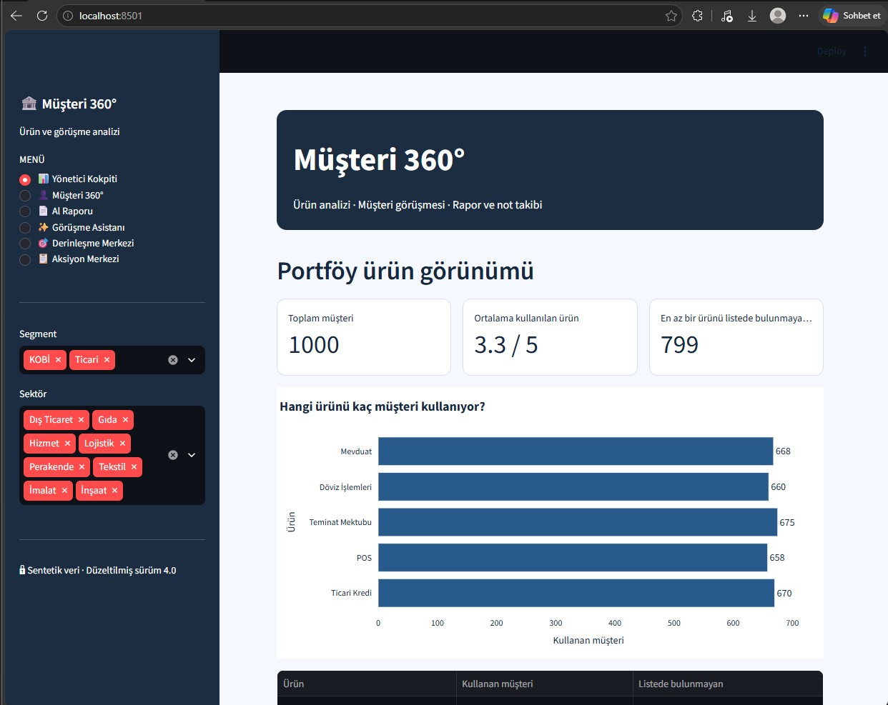
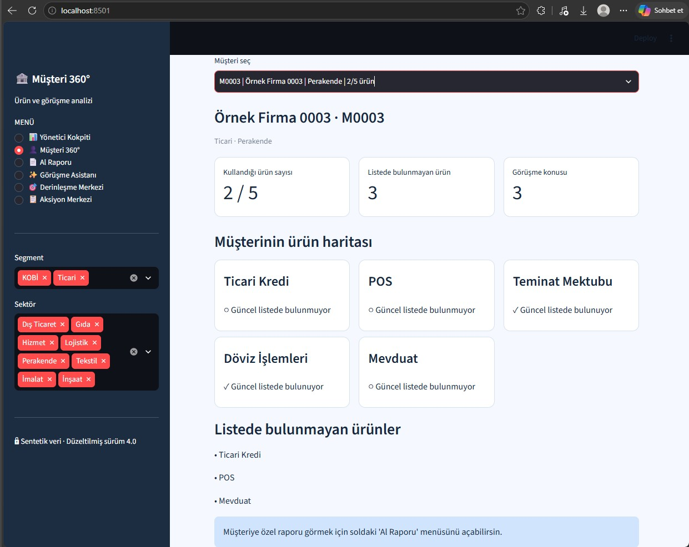

# 👤 Müşteri 360
Müşteri bilgilerini tek bir ekran üzerinden bütüncül şekilde incelemek amacıyla geliştirdiğim Python tabanlı bir eğitim ve portföy projesidir.

## 🎯 Projenin Amacı
Bu projede bankacılık deneyimimi Python ile bir araya getirerek, müşteri bilgilerinin farklı açılardan daha düzenli ve anlaşılır biçimde görüntülenebileceği örnek bir yapı oluşturdum.

Proje kapsamında:
- Eğitim amaçlı müşteri verileri oluşturulur.
- Müşteri bilgileri tek bir ekran üzerinden görüntülenir.
- Müşteriye ait farklı bilgiler bir araya getirilerek 360 derece müşteri görünümü oluşturulur.
- Kullanıcı dostu bir arayüz üzerinden müşteri incelemesi yapılır.

## 📁 Dosyalar

- `app.py` — Streamlit uygulamasının temel arayüzü
- `app_yeni.py` — Uygulamanın geliştirilmiş Streamlit arayüzü
- `musteri_360.py` — Müşteri verilerinin işlenmesi ve analiz yapısı
- `veri_uret.py` — Sentetik müşteri verilerinin oluşturulması

## 📸 Uygulama Görüntüleri

## 🎥 Proje Videosu
Müşteri 360 projesinin kısa tanıtım videosunu YouTube kanalımda izleyebilirsiniz: https://www.youtube.com/watch?v=eJvCFhIc6OE
